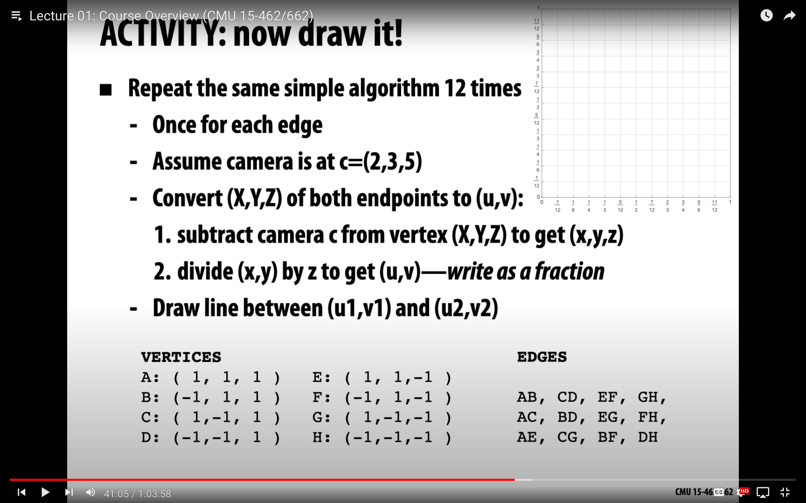
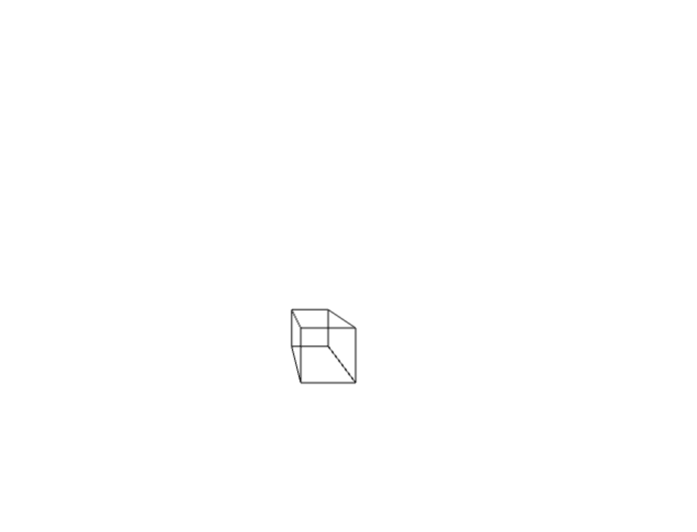

# Perspective Projection

<!--  -->




This code snippet demonstrates perspective projection in the context of computer graphics. It uses JavaScript and the canvas element to draw a 3D wireframe cube on a 2D canvas with a perspective effect. This was made after watching a introduction to computer graphics lecture as an take away 'assignment'

## How it Works

The script sets up the canvas element and its 2D rendering context.
It defines the 3D coordinates of the cube's vertices in the points array.
The EDGE_TABLE array represents the edges connecting the cube's vertices.
The camera position ca is specified, determining the perspective viewpoint.
Perspective projection is performed for each edge of the cube using the ctx.moveTo and ctx.lineTo methods to draw lines on the canvas.
Usage

To use this code, simply create an HTML file and include the following code:

```html
<!DOCTYPE html>
<html lang="en">
<head>
    <meta charset="UTF-8">
    <meta name="viewport" content="width=device-width, initial-scale=1.0">
    <title>Perspective Projection</title>
</head>
<body>
    <canvas id="canvas" width="500" height="500"></canvas>
    <script src="script.js"></script>
</body>
</html>
```


Then, create a JavaScript file (e.g., "script.js") and copy the provided code into it. When you open the HTML file in a web browser, the canvas will display the 3D wireframe cube with perspective projection.

Feel free to modify the points array to define different 3D objects and experiment with different camera positions (ca) to explore various perspectives. For more complex 3D scenes and rotations, you can implement additional transformations and rendering techniques.